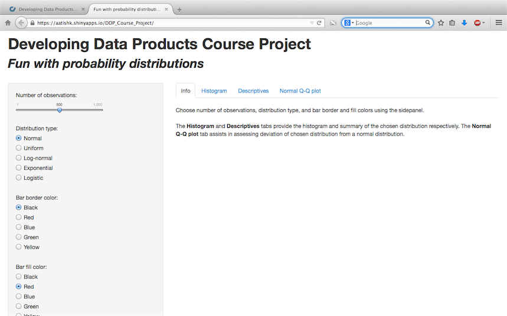

## Project in a nutshell

- Visualize several probability distributions
- Understand how they compare with normal distributions
- Developed as a Shiny application
- User can vary:
  - Number of observations
  - Type of distribution
  - Fill and border colors of bars of histogram
- Application output:
  - Histogram of distribution with user selected attributes
  - Descriptive statistics of the chosen distribution
  - Q-Q normal plot of the chosen distribution

--- 
## Normal distribution as an example

```{r fig.height=3.5}
# Take 1000 observations and generate summary
data <- rnorm(1000); summary(data)
# generate histogram and Q-Q plot of the data
par(mfrow=c(1,2)); hist(data); qqnorm(data);qqline(data, col = 2,lwd=2,lty=2)
```

---
## Shiny application


---
## Project links
- Links to project:
  - Shiny: [http://aatishk.shinyapps.io/DDP_Course_Project](http://aatishk.shinyapps.io/DDP_Course_Project)
  - Github repo: [http://github.com/aatishk/DDP_Course_Project](https://github.com/aatishk/DDP_Course_Project)
- Links to project pitch:
  - Rpubs: [http://rpubs.com/aatishk/DDP_Course_Project](http://rpubs.com/aatishk/DDP_Course_Project)
  - Github io: [http://aatishk.github.io/DDP_Course_Project](http://aatishk.github.io/DDP_Course_Project)

